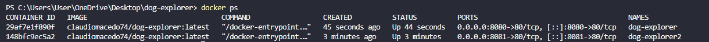

# 🐶 Dog Explorer

## Autor

**Cláudio Macedo**  
**Matrícula:** 22603506

---

# Descrição

O **Dog Explorer** é uma aplicação web desenvolvida com **HTML, CSS e JavaScript** que permite pesquisar diferentes raças de cães utilizando a **TheDogAPI**.

Além da pesquisa, o sistema permite **salvar, listar e excluir favoritos**, utilizando o **Supabase** como banco de dados para persistência das informações.

---

# API utilizada

**TheDogAPI**

Documentação:

https://thedogapi.com/

Endpoint utilizado:

```text
https://api.thedogapi.com/v1/breeds/search?q={nome_da_raca}
```

---

# Funcionalidades

- Pesquisar uma raça de cachorro.
- Exibir imagem da raça.
- Exibir nome da raça.
- Exibir peso.
- Exibir altura.
- Exibir expectativa de vida.
- Exibir temperamento (traduzido para português).
- Exibir grupo da raça.
- Exibir origem da raça.
- Exibir mensagem de carregamento.
- Exibir mensagem quando a raça não for encontrada.
- Salvar favoritos utilizando Supabase.
- Listar favoritos.
- Excluir favoritos.

---

# Tecnologias utilizadas

- HTML5
- CSS3
- JavaScript
- Fetch API
- REST API
- JSON
- Supabase
- Docker
- Nginx

---

# Persistência dos Dados

A aplicação utiliza o **Supabase** como banco de dados para armazenar os favoritos do usuário.

Foi criada uma tabela chamada **favoritos**, contendo os seguintes campos:

- id
- nome
- foto
- temperamento

Sempre que um favorito é adicionado, ele é armazenado no banco de dados e permanece salvo mesmo após fechar o navegador.

A aplicação também permite:

- Criar favoritos (CREATE)
- Listar favoritos (READ)
- Excluir favoritos (DELETE)

---

# Como executar localmente

Clone o repositório:

```bash
git clone https://github.com/claudiomacedo74/dog-explorer
```

Entre na pasta do projeto.

Abra o arquivo `index.html` ou utilize a extensão **Live Server** do Visual Studio Code.

---

# Executando com Docker

A imagem da aplicação está publicada no Docker Hub.

Execute:

```bash
docker run -d -p 8080:80 claudiomacedo74/dog-explorer:latest
```

Depois acesse:

```
http://localhost:8080
```

---

# Estrutura do projeto

```text
dog-explorer/
│
├── index.html
├── style.css
├── script.js
├── Dockerfile
├── .dockerignore
├── README.md
```

---

# Sidequest 1 — .dockerignore

Foi criado um arquivo `.dockerignore` para impedir que arquivos desnecessários fossem enviados para a imagem Docker.

Arquivos ignorados:

- .git
- README.md
- .vscode

Essa prática reduz o tamanho da imagem Docker e torna o processo de build mais rápido.

---

# Sidequest 2 — Versionamento da imagem

Foram publicadas três versões da imagem no Docker Hub:

- 1.0
- 1.1
- latest

---

# Sidequest 3 — Docker Hub

O repositório no Docker Hub contém:

- descrição da aplicação;
- comando `docker run`;
- link para o repositório GitHub.

---

# Sidequest 4 — Dois containers

Foram executados dois containers simultaneamente utilizando a mesma imagem Docker.

Container 1:

```
localhost:8080
```

Container 2:

```
localhost:8081
```

Evidência:

## Evidência



Exemplo:

```md

```

(Substitua o caminho pelo local onde você salvou o print.)

---

# Kubernetes

Caso fosse necessário executar **100 containers** simultaneamente, o gerenciamento manual seria inviável.

Nesse cenário, o **Kubernetes** seria utilizado para orquestrar os containers, organizando-os em um **cluster**. Cada aplicação seria executada em um **Pod**, podendo existir várias **réplicas** da mesma aplicação para distribuir a carga entre os servidores. Além disso, o Kubernetes monitora os containers e recria automaticamente aqueles que apresentarem falhas, garantindo maior disponibilidade e escalabilidade da aplicação.

---

# Links

## GitHub

https://github.com/claudiomacedo74/dog-explorer

---

## GitHub Pages

https://claudiomacedo74.github.io/dog-explorer/

---

## Docker Hub

https://hub.docker.com/r/claudiomacedo74/dog-explorer

---

# Imagens Docker publicadas

- claudiomacedo74/dog-explorer:1.0
- claudiomacedo74/dog-explorer:1.1
- claudiomacedo74/dog-explorer:latest

---

# Comando para avaliação

O avaliador poderá executar a aplicação utilizando apenas:

```bash
docker run -d -p 8080:80 claudiomacedo74/dog-explorer:latest
```